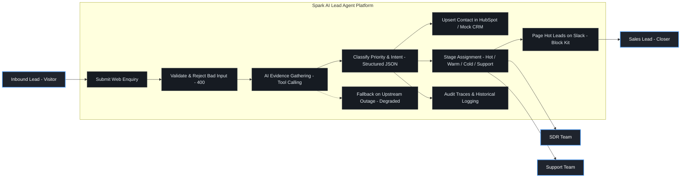
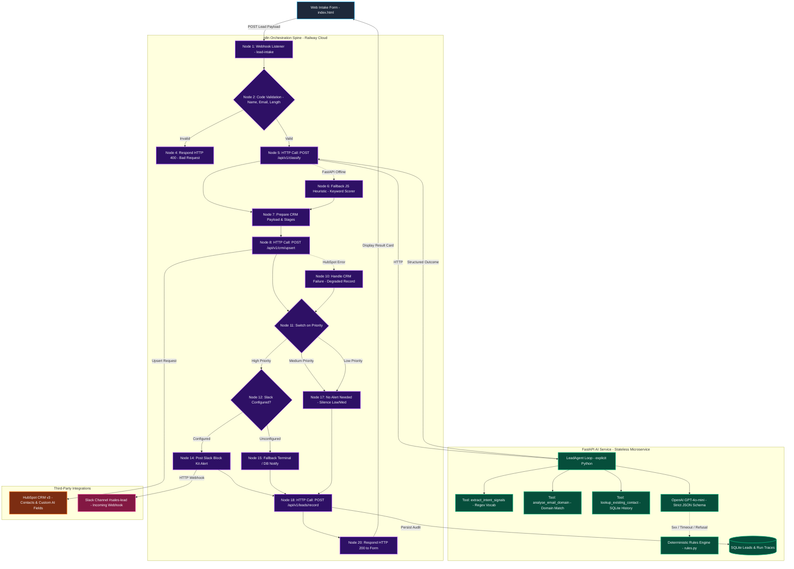
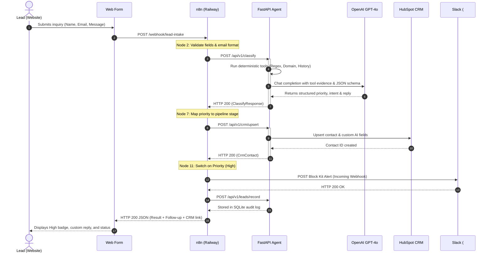

# System Diagrams (Mermaid)

This file contains the complete visual diagrams for the **Spark AI Lead Qualification Agent & n8n Automation**. These diagrams render automatically in GitHub, VS Code Markdown Preview, and any Mermaid-compatible viewer.

---

## 1. Use Case Diagram

Shows the user personas, external actors, and key capabilities of the AI triage platform.

---

## 2. Complete System Architecture & Data Flow

Illustrates the end-to-end cloud pipeline across the Web Form, Railway n8n Workflow, FastAPI Microservice, HubSpot CRM, and Slack.

---

## 3. Chronological Sequence Diagram

Illustrates the exact request-response lifecycle when a high-priority lead is processed.

